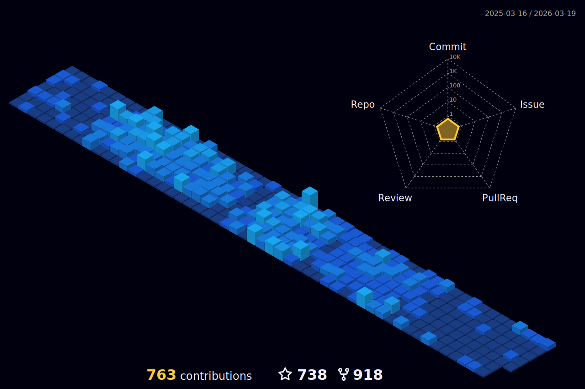

<h1> ABOUT ME</h1>
 

 
 
-  Proficient in a wide range of front-end technologies, including HTML, CSS, and JavaScript along with UI frameworks, such as Bootstrap, Material-UI and Tailwind CSS.

-  Proficient in DevOps, with extensive experience in using its core concepts and features to build complex tools and by deploying them on cloud by following the devops cycle and having clean hands on CI/CD.

-  Contributing to some exciting open source project have been always fun .

-  Experience with modern build tools such as Docker containers and orchestrating them using kubernetes with secured server protocol and full proofed scanned technologies.

-  I’m currently working on **SOME OPEN SOURCE PROJECTS**

-  Ask me about **Development ,Devops**

-  Goal: **Exploring everysingle things comes on way in depth**
-  How to reach me **kunj2021@gmail.com**

<h1>  EXPLORE SOME  PRODUCTS THAT I BUILD</h1>

|  |  |
| ------- | ------- |
|  [**CertiCraft**](https://certicraft.co) |  [**GitGinie**](https://gitginie.co) |
| Make Certifications easy like never before | Get your repository "Ginie" |
|  [**Proficiency**](https://proficiency.vercel.app) |  [**SheSync**](https://github.com/kunjgit/shesync) |
| Set Your schedule and increase your Proficiency | Sync your periods with SheSync |
|  [**SnipIt**](https://snip-it.vercel.app) |  [**Zayka**](https://github.com/kunjgit/Zayka) |
| Create and share beautiful code SnipIts | One Stop Solution to manage your food ventures |
|  [**Track Your Health**](https://github.com/kunjgit/Trackyourhealth) |  [**Ask Me**](https://github.com/Kailash8799/Ask_me) |
| Find your health history just by one click | Questions are everywhere, answers are on Ask Me! |
|  [**OpenVerse**](https://open-verse.vercel.app/) |  [**GitFlow**](https://github.com/kunjgit/GitFlow) |
| Learn open source the best way! | Automate your repo management in seconds! |
|  [**GameZone**](https://github.com/kunjgit/GameZone) | |
| Code and Collaborate with the GameZone community | |

 
 

<h1>  TOOLS</h1>
 

  
   
  
  
  
  
  
  
  
  
  
  
  
  
  
  
  
  
  

<h1>  GITHUB STATS</h1>
 

 
 

 <table align="center">
  <tr>
    <td align="center">
      
    </td>
    <td align="center">
       
    </td>
  </tr>
</table>     

<h1> CONTRIBUTIONS</h1>
 

        

    
