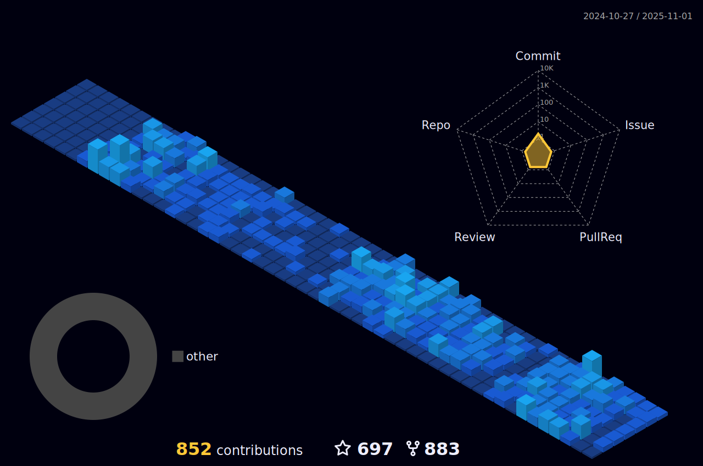

<h1> ABOUT ME</h1>
 

 
 
-  Proficient in a wide range of front-end technologies, including HTML, CSS, and JavaScript along with UI frameworks, such as Bootstrap, Material-UI and Tailwind CSS.

-  Proficient in DevOps, with extensive experience in using its core concepts and features to build complex tools and by depoying them on cloud by following the devops cycle and having clean hands on CI/CD.

-  Contributing to some exciting open source project have been always fun .

-  Experience with modern build tools such as Docker containers and orchastrating them using kubernetes with secured server protocol and full proofed scanned technologies.

-  I’m currently working on **SOME OPEN SOURCE PROJECTS**

-  Ask me about **Development ,Devops**

-  Goal: **Exploring everysingle things comes on way in depth**
-  How to reach me **kunj2019@gmail.com**

<h1>  GITHUB STATS</h1>
 

 
 
 <table align="center">
  <tr>
    <td align="center">
      
    </td>
    <td align="center">
        
    </td>
  </tr>
</table>     

<h1> CONTRIBUTIONS</h1>
 

        

    
